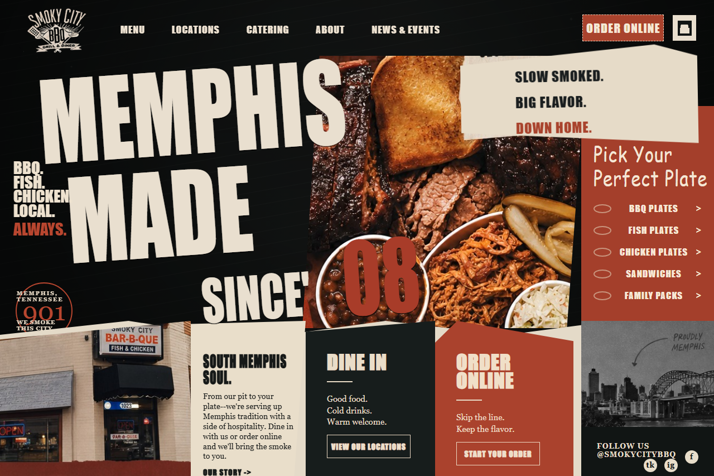

# 🎨 Web Design Lead Agent

> **Find local businesses with tired websites, auto-generate a real redesign mockup for each one, and produce a print-ready outreach packet — all reviewed by a human before anything goes out.**

Turn a single **ZIP code** into a reviewed list of small businesses worth pitching, each with a current-site screenshot, an AI redesign judgment, a freshly generated mockup, and a 3-page letter ready for the mailbox. 📬

It's a **bounded workflow with human approval**, not a free-running agent. AI does the judgment and generation; deterministic code owns discovery, cost control, state, and the send gate. 🧠 + ⚙️

---

## ✨ What it does

```
 ZIP code
    │
    ▼
 📍 Geocode  ──►  🔎 Google Places harvest  ──►  🧹 Dedupe + filter to real sites
                                                          │
                                                          ▼
                                              📸 Screenshot each website (Playwright)
                                                          │
                                                          ▼
                                  💸 Cheap multimodal pre-filter  (drop chains, parked, unsafe)
                                                          │
                                                          ▼
                                   🧐 Redesign reviewer  (needs_redesign? + reasoning + vibe)
                                                          │
                                                          ▼
                                   🖼️  Generate redesign mockup  (gpt-image-2, brand-aware)
                                                          │
                                                          ▼
                            🧑‍⚖️  HUMAN REVIEW  ◄── the runner stops here on purpose
                                                          │
                                                          ▼
                                   ✉️  Render 3-page PDF packet  (address · letter · mockup)
                                                          │
                                                          ▼
                                   🏤  PostGrid physical-mail send  (one-by-one, opt-in)
```

Every business becomes a **reviewed lead packet**: who they are, what their site looks like today, whether it's worth a redesign and *why*, a concrete visual idea, and a printable proof — so the operator can approve, revise, skip, or queue follow-up.

---

## 🖼️ Example output

A flat AI-generated mockup, rebuilt into a working, responsive page during the proof phase:



The mockup keeps the business's **brand** (logo, palette, voice) but rebuilds the **layout** from scratch — the original screenshot is passed in as a brand reference, not a template to copy.

---

## 🧱 How it's built

| Layer | Does | Tech |
| --- | --- | --- |
| 🔎 **Discovery** | ZIP → geocode → Google Places harvest → dedupe | Python, Google Places API |
| 📸 **Evidence** | Full-page website screenshots | Playwright (local Chromium) |
| 💸 **Pre-filter** | Cheaply exclude non-prospects & unsafe pages (~$0.0005/call) | `gpt-5.4-nano` multimodal |
| 🧐 **Review** | Judge redesign opportunity + fill the mockup recipe | `gpt-5.5`, high reasoning effort |
| 🖼️ **Mockup** | Brand-aware redesign image | `gpt-image-2` via Responses API |
| 🗃️ **State** | Source of truth for runs, leads, steps, artifacts, costs | SQLite (idempotent step replay) |
| ✉️ **Packet** | 3-page print-ready PDF (window-envelope address, letter, mockup) | Playwright print + `pypdf` |
| 🖥️ **Operator UI** | Inspect → approve / skip, live run ticker | FastAPI + SSE |
| 🏤 **Send** | Physical letter delivery | PostGrid (test/live, one-by-one) |

**Cost-aware by design:** the cheap filter runs first so excluded leads never burn an expensive review call, every provider call records its USD cost, and a per-run spend cap (`MAX_RUN_COST_USD`) is checked before each mockup.

---

## 🚀 Quickstart

> Requires **Python 3.13+** and [`uv`](https://github.com/astral-sh/uv).

```bash
# 1. Install dependencies
uv sync
uv run playwright install chromium

# 2. Configure secrets (never commit this file)
cp .env.sample .env
#   then fill in:
#   - GOOGLE_MAPS_API_KEY   (Places + geocoding)
#   - OPENAI_API_KEY        (filter, review, mockup)
#   - AGENCY_* / SIGNATURE_NAME   (your letterhead + return address)
#   - POSTGRID_API_KEY      (optional, for real mail — keep POSTGRID_MODE=test)

# 3. (Optional) refresh the local ZIP lookup dataset — see data/geonames/AGENTS.md

# 4. Launch the operator UI — the single entry point
uv run python -m ui.server
```

The UI launches the pipeline worker as a subprocess when you submit a location. Open the local URL it prints, enter a ZIP, and review leads as they land. 🎛️

---

## 🗂️ Project structure

```
src/
  core.py          # paths/env, helpers, SQLite WorkflowStore (source of truth)
  pipeline.py      # discovery → screenshot → AI filter → review → mockup
  runner.py        # pipeline worker subprocess (isolated from the UI)
  outreach.py      # 3-page packet → PDF (Playwright print + pypdf merge)
  postgrid.py      # physical-mail send (test/live)
  zip_lookup.py    # city/state → ZIP via local GeoNames data
ui/
  server.py        # FastAPI operator shell + SSE ticker + approve/skip
  templates/       # Jinja2 review screens
proofs/            # phase proofs (e.g. flat mockup → working code)
tests/             # 10 test files covering store, cost cap, escaping, steps…
data/geonames/     # local ZIP dataset (GeoNames, CC-BY)
IDEA.md            # the full product spec & tool-harness readiness map
```

---

## 🧭 Status & roadmap

This is an early, **honestly-scoped** build — proven end-to-end on small local runs, not yet calibrated at scale. ✅ = working, 🔬 = proven on narrow runs, 🛠️ = path-to-test.

- ✅ ZIP → geocode → Places → screenshots → filter → review → mockup, end-to-end
- ✅ SQLite source of truth with idempotent step replay + per-call cost tracking
- ✅ 3-page print-ready PDF packet (window-envelope address · letter · mockup)
- 🔬 Mockup quality (validated on individual businesses; needs broader calibration)
- 🔬 Cheap pre-filter accuracy (correctly drops chains; needs over-exclusion check)
- 🛠️ Broad Google Places recall + dedupe quality at ZIP scale
- 🛠️ Human original-vs-mockup review UI (runner intentionally stops before outreach)
- 🛠️ AI-drafted personalized letter copy (currently a polished static template)
- 🛠️ PostGrid live send + physical-mail compliance / suppression

See [`IDEA.md`](IDEA.md) for the full opportunity, tool-harness readiness table, workflow map, and open gaps.

---

## 🔒 Safety & guardrails

- **Human in the loop before any send** — the pipeline stops after the mockup; nothing leaves without explicit approval.
- **One-by-one sending** until quality, compliance, and provider reliability are proven — no bulk blasts.
- **Per-run spend cap** enforced before expensive image generation.
- **Secrets stay local** — `.env` is gitignored; only `.env.sample` (placeholders) ships.

---

## 🙏 Attribution

Postal-code data from [**GeoNames**](https://www.geonames.org/), used under **Creative Commons Attribution**. See [`data/geonames/AGENTS.md`](data/geonames/AGENTS.md).

## 📄 License

Released under the [MIT License](LICENSE).
